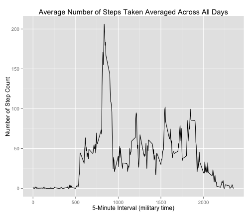
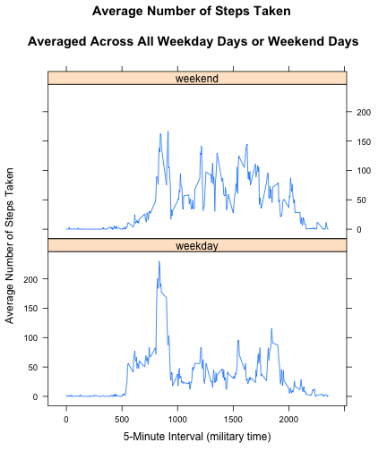

# Reproducible Research: Peer Assessment 1
by Joshua Jin (June, 2014)

## Introduction

The goal of this assignment to practice skills needed for reproducible research. Specifically this assignment use R markdown to write a report that answers the questions detailed in the sections below.  In the process, the single R markdown document will be processed by knitr and be transformed into an HTML file.  

Start this assignment with fork/clone the GitHub repository created for this assignment. When finish, submit this assignment by pushing your completed files into your forked repository on GitHub. The assignment submission will consist of the URL to your GitHub repository and the SHA-1 commit ID for your repository state.

## Data
This assignment makes use of data from a personal activity monitoring device. This device collects data at 5 minute intervals through out the day. The data consists of two months of data from an anonymous individual collected during the months of October and November, 2012 and include the number of steps taken in 5 minute intervals each day. The data for this assignment can be downloaded from the course web site:
Dataset: [Activity monitoring data] (https://d396qusza40orc.cloudfront.net/repdata%2Fdata%2Factivity.zip) [52K]
The variables included in this dataset are:
* steps: Number of steps taking in a 5-minute interval (missing values are coded as NA)
* date: The date on which the measurement was taken in YYYY-MM-DD format
* interval: Identifier for the 5-minute interval in which measurement was taken
The dataset is stored in a comma-separated-value (CSV) file and there are a total of 17,568 observations in this dataset.

## Loading and preprocessing
Load input data from a zip file from the current R working directory.


```r
data <- read.table(unz("activity.zip", "activity.csv"), header=T, quote="\"", sep=",")

# convert date to date data type
data$date <- as.Date(data$date) 
```


## What is mean total number of steps taken per day?
* Create a new dataset ignoring missing data NA 
* Plot a histogram of the total number of steps taken each day 
* Report the mean and median total number of steps taken per day 


```r
data.ignore.na <- na.omit(data) 

# sum steps by date
daily.steps <- rowsum(data.ignore.na$steps, format(data.ignore.na$date, '%Y-%m-%d')) 
daily.steps <- data.frame(daily.steps) 
names(daily.steps) <- ("steps") 
```

Plot histogram of the total number of steps taken each day:

```r
hist(daily.steps$steps, 
     main=" ",
     breaks=10,
     xlab="Total Number of Steps Taken Daily")
```

 

Report mean and median of steps:

```r
mean(daily.steps$steps); 
```

```
## [1] 10766
```

```r
median(daily.steps$steps) 
```

```
## [1] 10765
```

## What is the average daily activity pattern?
* Calculate average steps for each of 5-minute interval during a 24-hour period.
* Make a time series plot (i.e. type = "l") of the 5-minute interval (x-axis) and the average number of steps taken, averaged across all days (y-axis)
* Report which 5-minute interval, on average across all the days in the dataset, contains the maximum number of steps?
* Observer and comment the average daily activity pattern


```r
library(plyr)
# Calculate average steps for each of 5-minute interval during a 24-hour period
interval.mean.steps <- ddply(data.ignore.na,~interval, summarise, mean=mean(steps))
```

Plot time series of the 5-minute interval and the average number of steps taken, averaged across all days

```r
library(ggplot2)
qplot(x=interval, y=mean, data = interval.mean.steps,  geom = "line",
      xlab="5-Minute Interval (military time)",
      ylab="Number of Step Count",
      main="Average Number of Steps Taken Averaged Across All Days"
      )
```

 

Report the 5-min interval, on average across all the days in 
the dataset, contains the maximum number of steps:

```r
interval.mean.steps[which.max(interval.mean.steps$mean), ]
```

```
##     interval  mean
## 104      835 206.2
```

##### Observations: 
Based on steps taken pattern, the person's daily activity peaks around 8:35am.  


## Imputing missing values
Note that there are a number of days/intervals where there are missing values (coded as NA). The presence of missing days may introduce bias into some calculations or summaries of the data. In this section:

* Calculate and report the total number of missing values in the dataset (i.e. the total number of rows with NAs)
* Implement a strategy for filling in all of the missing values in the dataset. For this assignment the strategy is to use the mean for that 5-minute interval to replace missing valuse. Create a new dataset that is equal to the original dataset but with the missing data filled in.
* Make a histogram of the total number of steps taken each day
* Calculate and report the mean and median total number of steps taken per day. 
* Make following comments: Do these values differ from the estimates from the first part of the assignment? What is the impact of imputing missing data on the estimates of the total daily number of steps?

Calculate and report the total number of missing values in the dataset (i.e. the total number of rows with NAs)

```r
library(sqldf)
```

```
## Loading required package: gsubfn
## Loading required package: proto
## Loading required namespace: tcltk
## Loading required package: RSQLite
## Loading required package: DBI
## Loading required package: RSQLite.extfuns
```

```r
tNA <- sqldf(' 
    SELECT d.*            
    FROM "data" as d
    WHERE d.steps IS NULL 
    ORDER BY d.date, d.interval ') 
```

```
## Loading required package: tcltk
```

```r
NROW(tNA) 
```

```
## [1] 2304
```

Implement a strategy for filling in all of the missing values in the dataset. For this assignment the strategy is to use the mean for that 5-minute interval to replace missing valuse. Create a new dataset (t1) that is equal to the original dataset but with the missing data filled in. The dataset is ordered by date and interval. The following SQL statement combines the original "data" dataset set and the "interval.mean.steps" dataset that contains mean values of each 5-min interval ageraged across all days. 

```r
t1 <- sqldf('  
    SELECT d.*, i.mean
    FROM "interval.mean.steps" as i
    JOIN "data" as d
    ON d.interval = i.interval 
    ORDER BY d.date, d.interval ') 

t1$steps[is.na(t1$steps)] <- t1$mean[is.na(t1$steps)]
```

In the following, prepare data for plot histogram calculate mean and median:

```r
t1.total.steps <- as.integer( sqldf(' 
    SELECT sum(steps)  
    FROM t1') );

t1.total.steps.by.date <- sqldf(' 
    SELECT date, sum(steps) as "t1.total.steps.by.date" 
    FROM t1 GROUP BY date 
    ORDER BY date') 

daily.61.steps <- sqldf('   
    SELECT date, t1_total_steps_by_date as "steps"
    FROM "t1.total.steps.by.date"
    ORDER BY date') 
```

Make a histogram of the total number of steps taken each day.

```r
hist(daily.61.steps$steps, 
     main=" ",
     breaks=10,
     xlab="After Imputate NA -Total Number of Steps Taken Daily")
```

 

Calculate and report the mean and median total number of steps taken per day. 

```r
t1.mean.steps.per.day <- as.integer(t1.total.steps / NROW(t1.total.steps.by.date) )
t1.mean.steps.per.day
```

```
## [1] 10766
```

```r
t1.median.steps.per.day <- median(t1.total.steps.by.date$t1.total.steps.by.date)
t1.median.steps.per.day
```

```
## [1] 10766
```

##### Observations: 
* Do these values (mean and median) differ from the estimates from the first part of the assignment? Not Really. 

* What is the impact of imputing missing data on the estimates of the total daily number of steps? The shape of the histogram remains the same as the histogram from removed missing values. However, the frequency counts increased as expected. In this case, it seems that the data imputation strategy should work for the downstream data analysis and modeling.  

## Are there differences in activity patterns between weekdays and weekends?
* Use the dataset with the filled-in missing values for this part. Create a new factor variable in the dataset with two levels – “weekday” and “weekend” indicating whether a given date is a weekday or weekend day.
* Make a panel plot containing a time series plot (i.e. type = "l") of the 5-minute interval (x-axis) and the average number of steps taken, averaged across all weekday days or weekend days (y-axis). 

Create a factor variable weektime with two levels (weekday, weekend). The folowing dataset t5 dataset contains data: average number of steps taken averaged across all weekday days and weekend days, 5-min intervals, and a facter variable weektime with two levels (weekday, weekend).

```r
t1$weektime <- as.factor(ifelse(weekdays(t1$date) %in% 
                c("Saturday","Sunday"),"weekend", "weekday"))

t5 <- sqldf('   
    SELECT interval, avg(steps) as "mean.steps", weektime
    FROM t1
    GROUP BY weektime, interval
    ORDER BY interval ')
```

Make a panel plot containing a time series plot (i.e. type = "l") of the 5-minute interval (x-axis) and the average number of steps taken, averaged across all weekday days or weekend days (y-axis).

```r
library("lattice")
p <- xyplot(mean.steps ~ interval | factor(weektime), data=t5, 
       type = 'l',
       main="Average Number of Steps Taken 
       \nAveraged Across All Weekday Days or Weekend Days",
       xlab="5-Minute Interval (military time)",
       ylab="Average Number of Steps Taken")
print (p)    
```

 
##### Observations: 
* Are there differences in activity patterns between weekdays and weekends? Yes. The plot indicates that the person moves around more (or more active) during the weekend days. 

## Conclusion
In this assignment, it provided a step-by-step approach for analyzing data. The data analysis started from loading data, transform data including the strategy and implementation of dealing with missing data, and reporting statistical data and plots. The reader should be able to follow the document and reproduce the same results. The document was prepared with R version 3.0.2 on Mac OS X v10.9.3.


